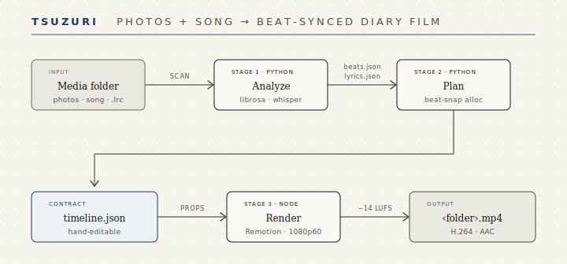

# tsuzuri(綴り)

> Photos + a song (+ optional lyrics) → a beat-synced visual diary. One command, fully local.

綴る: to write a diary, to bind an album — weaving photos together with sound.

[中文](README.md) · **English**

## Showcase


<!-- placeholder: terminal output screenshot -->

## Quick start

```bash
# Prerequisites: Node 18+ · uv · FFmpeg
#   macOS: brew install node ffmpeg uv
#   elsewhere: nodejs.org · docs.astral.sh/uv · ffmpeg.org
cd renderer && npm install && cd ..
node cli/tsuzuri.mjs doctor          # optional: instant dependency preflight with fix hints

# A media folder = photos + exactly one audio file + optionally one .lrc
node cli/tsuzuri.mjs ./osaka-trip
# → ./osaka-trip/output/osaka-trip.mp4
```

> **First run**: without an `.lrc`, the Whisper model is downloaded once (small ≈ 500 MB on CPU, medium ≈ 1.5 GB on Apple Silicon / CUDA). Rendering at 60fps is CPU-heavy — a 3-minute song typically takes a few minutes and your fans will spin. That's normal.

This is the only everyday command; the single flag is `-o <path>` to change the output location. Everything else is decided automatically:

| Decision | Auto rule |
| --- | --- |
| Photo order | EXIF capture time first, filename fallback |
| Subtitles | `.lrc` wins; otherwise local Whisper; pure music → skipped |
| Flash mode | avg display < 2s → cut on every beat |
| Long song, few photos | avg > 10s → trim at a downbeat + fade out |
| Tweak & re-render | hand-edit `metadata/timeline.json`, rerun → analysis is skipped |
| Loudness | normalized to −14 LUFS (TP −1.5 dB) |

Drop a `tsuzuri.toml` in the folder to override defaults (resolution / fps / transitions / flash & trim thresholds / subtitles …) — full reference in [docs/config.md](docs/config.md) (Chinese).

## How it works



Analyze / Plan / Render are three independent stages that only talk through JSON files under `metadata/`. `timeline.json` is the hand-editable contract (schema: [docs/specs/timeline-schema.md](docs/specs/timeline-schema.md)); rerunning with unchanged material skips analysis and renders your edited timeline directly.

<details>
<summary>Folder contract &amp; LRC notes</summary>

```text
osaka-trip/
├── photo-01.jpg …             # .jpg .jpeg .png .webp
├── music.mp3                  # exactly one audio: .mp3 .m4a .wav .flac .aac .ogg
├── lyrics.lrc                 # optional; UTF-8/BOM line-synced LRC
├── metadata/                  # generated: beats.json / lyrics.json / timeline.json
└── output/
    └── osaka-trip.mp4
```

LRC supports `[mm:ss.xx]`, multiple timestamps per line, `[offset:±ms]`, and empty timed lines that clear the caption; multiple `.lrc` files or conflicting duplicate timestamps fail with a clear error. Legacy root-level JSON is copied into `metadata/` automatically, originals kept.

Video clips (`.mp4`, `.mov`, …) are not supported yet: they won't appear in the film — the scanner warns and ignores them.

</details>

## Commands

```bash
node cli/tsuzuri.mjs ./osaka-trip               # render (the only everyday command)
node cli/tsuzuri.mjs ./osaka-trip -o out.mp4    # custom output path
node cli/tsuzuri.mjs doctor                     # dependency preflight with fix hints
node cli/tsuzuri.mjs lyrics ./osaka-trip        # preview lyric recognition before rendering
node cli/tsuzuri.mjs help                       # usage (same as -h / --help)
```

`lyrics` lists every line with timestamps and confidence; lines below the render threshold (0.6) are flagged — check recognition quality before spending minutes on a render.

## 100% local

No cloud, no API keys. The Whisper backend matches your hardware automatically (Apple Silicon → mlx / NVIDIA → CUDA / otherwise CPU int8); if huggingface.co is unreachable, the one-time model download switches to the hf-mirror.com mirror. Noto Serif JP / SC / Latin fonts (SIL OFL 1.1) are bundled for fully offline rendering.

**Platforms**: tested on macOS (Apple Silicon); Linux should work (faster-whisper CPU / CUDA paths); Windows is code-compatible but untested — feedback welcome.

## FAQ

**Model download slow or failing?** The mirror kicks in automatically when huggingface.co is unreachable; you can also set `HF_ENDPOINT` yourself, or download a model into the repo's `models/` directory (`models/whisper-<size>-mlx` or `models/faster-whisper-<size>`) to go fully offline.

**Some lyrics are missing from the video?** Lines with confidence below 0.6 are filtered. Preview with `node cli/tsuzuri.mjs lyrics <folder>`; if recognition is poor, provide an `.lrc` to take over subtitles entirely.

**Weak vocals, bad recognition?** `cd analyzer && uv sync --extra separation` installs demucs; on low confidence the analyzer separates vocals and retries once automatically.

**Rendering is slow, fans are loud?** Expected: frame-by-frame 60fps rendering plus H.264 encoding is CPU-bound. If 30fps is acceptable, set `fps = 30` in `tsuzuri.toml` — roughly halves the time.

**Different Whisper model?** Set `TSUZURI_WHISPER_MODEL=tiny|small|medium` (or a local model directory path) before running.

**Video clips as input?** Not supported yet: the scanner warns and ignores them.

## Development

```bash
cd analyzer && uv run pytest        # allocation + lyric parsing tests
cd cli && npm test                  # CLI / terminal output tests
cd renderer && npm run typecheck    # renderer types
cd renderer && npm run studio       # live-preview the fixture timeline
```

Plan & status (Chinese): [docs/tsuzuri-implementation-plan.md](docs/tsuzuri-implementation-plan.md) · [docs/tsuzuri-status.md](docs/tsuzuri-status.md)

## License

Code is [MIT](LICENSE); bundled Noto Serif JP / SC / Latin fonts are under the [SIL OFL 1.1](renderer/src/fonts/OFL.txt) and are freely redistributable with the repo.
