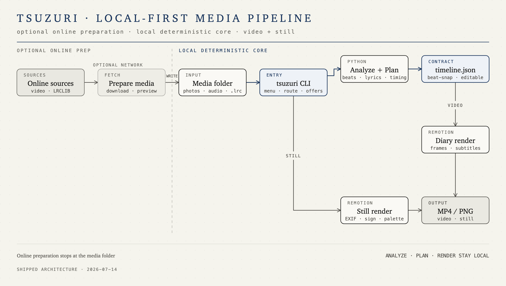

# tsuzuri（綴り）

> 照片 + 一首歌（可选歌词），自动生成踩点影像日记。分析与渲染全程本地，在线备料可选。

**中文** · [English](README.en.md)

## 快速开始

需要 [Node.js 18+](https://nodejs.org/)、[uv](https://docs.astral.sh/uv/) 和 [FFmpeg](https://ffmpeg.org/)。macOS 可通过 `brew install node uv ffmpeg` 安装。

```bash
npm --prefix cli install
npm --prefix renderer install
node cli/tsuzuri.mjs doctor
```

准备一个素材文件夹：

```text
osaka-trip/
├── photo-01.jpg
├── photo-02.jpg
└── audio/
    ├── music.mp3
    └── lyrics.lrc
```

自备素材时，其中应包含若干照片、唯一一份音频，可选一份 `.lrc`。如果缺少音频或歌词，
音频和 `.lrc` 可以放在根目录或 `audio/`，不必迁移旧项目；`fetch` 获取的新素材统一放入
`audio/`。也可以先运行 `node cli/tsuzuri.mjs fetch ./osaka-trip` 交互补齐。然后运行：

```bash
node cli/tsuzuri.mjs ./osaka-trip
```

成片默认写入 `osaka-trip/output/osaka-trip.mp4`。没有 `.lrc` 时，tsuzuri 会在首次运行时下载 Whisper 模型并在本地识别歌词。

## 使用

```bash
node cli/tsuzuri.mjs
node cli/tsuzuri.mjs ./osaka-trip
node cli/tsuzuri.mjs ./osaka-trip -o out.mp4
node cli/tsuzuri.mjs lyrics ./osaka-trip
node cli/tsuzuri.mjs fetch ./osaka-trip
node cli/tsuzuri.mjs still ./photo.jpg
node cli/tsuzuri.mjs still ./photos --exif --sign --dark
node cli/tsuzuri.mjs doctor
node cli/tsuzuri.mjs help
```

不带参数会打开常驻交互菜单：每个流程完成或报错后都会回到主菜单，输入 `q` 才退出；带参数
命令仍执行一次后退出。常用命令包括：

| 命令 | 用途 |
| --- | --- |
| `<folder>` | 分析音频、规划时间线并渲染视频 |
| `lyrics <folder>` | 预览歌词识别结果，不渲染 |
| `fetch <folder>` | 在线获取音频/歌词到素材夹（交互） |
| `still <photo\|folder>` | 导出同款静态 PNG |
| `doctor` | 检查本地依赖 |

`still` 支持 `-o`、`--exif`、`--sign`、`--dark`、`--skip-existing` 和 `--scale <1-4>`；完整用法以 `node cli/tsuzuri.mjs help` 为准。

tsuzuri 会自动处理：

- 照片均有 EXIF 时间时按拍摄时间排列，否则按文件名排列
- 优先读取 `.lrc`，否则使用本地 Whisper；纯音乐自动跳过字幕
- 交互终端下缺音频/歌词时，主动提议在线获取（同 `fetch`）；素材齐备则不打扰
- 根据照片数量和歌曲长度选择踩点节奏，必要时在重拍处裁歌并淡出
- 将成片响度归一到 −14 LUFS（TP −1.5 dB）

目前支持 `.jpg`、`.jpeg`、`.png`、`.webp` 图片，以及 `.mp3`、`.m4a`、`.wav`、`.flac`、`.aac`、`.ogg` 音频；视频素材暂不支持。

## 架构



`fetch` 只负责把可选的在线素材写入素材夹；照片、音频和 LRC 就绪后，Analyze、Plan、
Remotion 渲染与响度处理都在本地完成。视频与 still 共用画布、字体、照片和配色系统。

## 可选在线备料

```bash
node cli/tsuzuri.mjs fetch ./osaka-trip
```

1. 缺音频时，可输入你有权使用的视频 URL，或用关键词从 5 个 yt-dlp 候选中选择。
2. 若素材夹已有多个音频，可选择保留一个；确认后才会删除其余文件，放弃则不改动文件。
3. 下载后输入歌曲名和可选歌手，按 `audio/歌曲名 - 歌手.ext` 整理文件名；视频标题只作参考，替换已有音频必须确认。
4. [LRCLIB](https://lrclib.net) 按歌曲信息和音频时长搜索同步歌词；时长差超过 3 秒的候选会标出风险。
5. 分页预览全部带时间戳的歌词后再保存到 `audio/`；中文优先转为简体，英文和日文保持原文。

交互入口会显示全局按键图例：回车执行题目所示的安全默认动作，存在上一步时用 `0` 返回，
任意交互问题输入 `q` 退出整个 tsuzuri，Ctrl+C 中断。其他动作使用问题中明确显示的字母键；未知
按键会原地提示，不会被静默当成确认或取消。

音频下载需要自行安装 [yt-dlp](https://github.com/yt-dlp/yt-dlp)（macOS：`brew install yt-dlp`），
`fetch` 只在实际下载时检查。已有歌词不会静默覆盖；放弃或没有匹配结果不算错误，仍可使用
本地歌词识别（音频不会上传）。退出交互会立即清理尚未确认的临时下载，下次需要重新下载。
只有交互终端会主动提议在线补齐，管道和脚本不会进入联网问答。

## 配置与文档

在素材文件夹中添加 `tsuzuri.toml`，可调整分辨率、帧率、过渡、字幕、背景和片头片尾。

分析结果保存在 `metadata/`。素材未变化时，可直接修改 `metadata/timeline.json` 后重跑，tsuzuri 会保留手动时间线并跳过重复分析。

所有分析和渲染均在本地完成，不需要 API key。Whisper 会根据 Apple Silicon、NVIDIA CUDA 或 CPU 自动选择后端；模型仅在首次使用时下载。

- [配置参考](docs/config.md)：`tsuzuri.toml` 的全部选项
- [时间线格式](docs/specs/timeline-schema.md)：手动编辑 `timeline.json` 或开发渲染器
- [项目状态](docs/tsuzuri-status.md)：当前能力、约束和待验证事项

## 开发

```bash
cd analyzer && uv run pytest
cd cli && npm test
cd renderer && npm run typecheck
cd renderer && npm run studio
```

## 许可

代码采用 [MIT](LICENSE) 许可；内置 Noto 字体采用 [SIL OFL 1.1](renderer/src/fonts/OFL.txt)。
