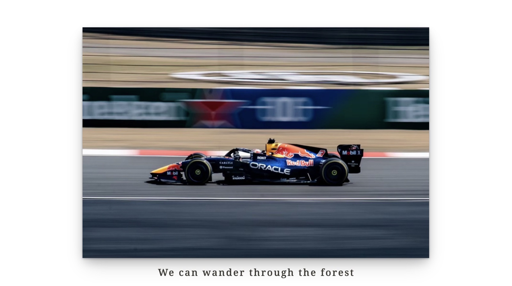
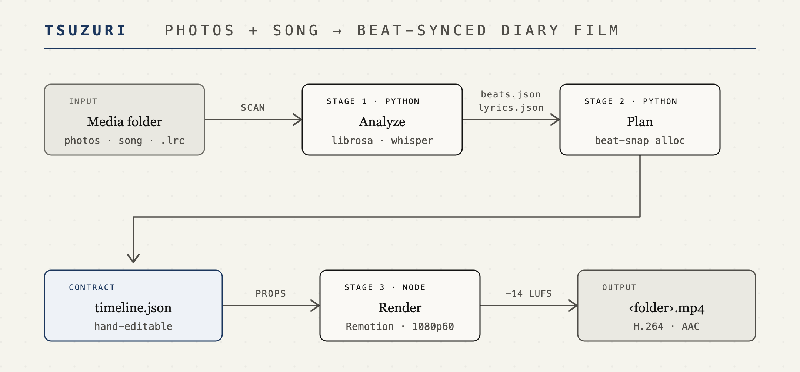
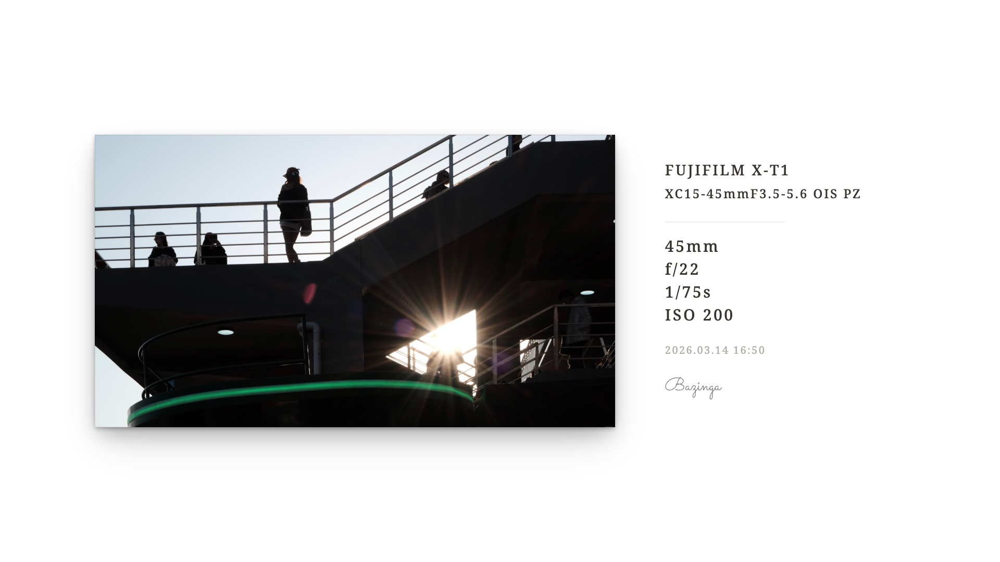

# tsuzuri(綴り)

> Photos + a song (+ optional lyrics) → a beat-synced visual diary. One command, fully local.
>
> 照片 + 一首歌(+ 可选歌词),缀成踩点影像日记。一条命令,全程本地,无需剪辑软件。

綴る:缀写日记、装订相册 — 写真を音で綴る。

**中文** · [English](README.en.md)

## Showcase / 效果



<!-- 截图占位:终端一条命令跑完的输出 -->

## Quick start / 快速开始

```bash
# 依赖:Node 18+ · uv · FFmpeg
#   macOS 一键:brew install node ffmpeg uv
#   其他平台:nodejs.org · docs.astral.sh/uv · ffmpeg.org
cd renderer && npm install && cd ..
node cli/tsuzuri.mjs doctor          # 可选:秒级预检依赖,缺什么直接给修复命令

# 素材文件夹 = 若干照片 + 唯一音频 + 可选一份 .lrc
node cli/tsuzuri.mjs ./osaka-trip
# → ./osaka-trip/output/osaka-trip.mp4
```

> **首跑预期**:没有 `.lrc` 时首次运行会自动下载 Whisper 模型(CPU 后端 small 约 500 MB,Apple Silicon / CUDA 用 medium 约 1.5 GB,仅一次);60fps 逐帧渲染较吃 CPU,一首 3 分钟的歌通常需要几分钟,风扇转属正常。

日常只有这一条命令,唯一的 flag 是 `-o <path>` 改输出路径。其余全部自动决策:

| 决策 | 自动规则 |
| --- | --- |
| 照片顺序 | EXIF 拍摄时间优先,无则按文件名 |
| 字幕 | `.lrc` 优先;否则本地 Whisper 识别;纯音乐自动跳过 |
| 快闪模式 | 人均展示 < 2s → 逐拍切换 |
| 歌长图少 | 人均 > 10s → 在重拍处截断歌曲 + 淡出收尾 |
| 微调重渲 | 手改 `metadata/timeline.json` 后重跑,跳过分析直接渲染 |
| 片头片尾 | 开场手写签名写入 + 片尾谢幕语;可用 `tsuzuri.toml` 换签名 SVG / 文案 / 关片头;首图过短自动跳过片头 |
| 响度 | 成片归一到 −14 LUFS(TP −1.5 dB) |

文件夹内可放 `tsuzuri.toml` 覆盖默认值(分辨率 / 帧率 / 过渡 / 快闪与裁歌阈值 / 字幕开关 / 片头片尾 …),全部配置项见 [docs/config.md](docs/config.md)。

## How it works / 工作原理



Analyze / Plan / Render 三个阶段彼此独立,只通过 `metadata/` 下的 JSON 文件衔接;`timeline.json` 是可手改的契约(schema 见 [docs/specs/timeline-schema.md](docs/specs/timeline-schema.md)),素材未变时重跑会跳过分析、直接按改后的时间线渲染。

<details>
<summary>文件夹约定与 LRC 细节 / Folder contract &amp; LRC notes</summary>

```text
osaka-trip/
├── photo-01.jpg …             # .jpg .jpeg .png .webp
├── music.mp3                  # 唯一音频:.mp3 .m4a .wav .flac .aac .ogg
├── lyrics.lrc                 # 可选;UTF-8/BOM 行级 LRC
├── metadata/                  # 生成物:beats.json / lyrics.json / timeline.json
└── output/
    └── osaka-trip.mp4
```

LRC 支持 `[mm:ss.xx]`、同行多时间戳、`[offset:±ms]`、空时间行清除字幕;多份 `.lrc` 或同一时间戳配不同文本会明确报错。旧版根目录 JSON 会自动复制进 `metadata/`,原件保留。

视频素材(`.mp4` `.mov` 等)暂不支持:不会出现在成片里,扫描时会在终端提醒后忽略。

</details>

## Commands / 命令速查

不带参数运行 `node cli/tsuzuri.mjs` 会进入交互菜单:数字选择功能、拖入路径回车,执行前回显等效命令行——用一次就能学会直达写法。菜单只在交互终端出现,脚本/管道里仍按下表用法。

```bash
node cli/tsuzuri.mjs                            # 交互菜单(数字选择,新手入口)
node cli/tsuzuri.mjs ./osaka-trip               # 渲染成片(日常命令)
node cli/tsuzuri.mjs ./osaka-trip -o out.mp4    # 自定义输出路径
node cli/tsuzuri.mjs still ./photo.jpg          # 按视频同款视觉导出 PNG(默认 2× 超采样)
node cli/tsuzuri.mjs still ./photos --exif      # 批量 + EXIF 展签面板
node cli/tsuzuri.mjs still ./photos --sign      # 加入 toml 同源签名落款
node cli/tsuzuri.mjs still ./photos --dark      # 黑底暗厅色板(文件名追加 -dark)
node cli/tsuzuri.mjs still ./photos --skip-existing # 批量续跑,显式跳过已存在文件
node cli/tsuzuri.mjs doctor                     # 预检依赖,失败项附修复命令
node cli/tsuzuri.mjs lyrics ./osaka-trip        # 渲染前预览歌词识别结果
node cli/tsuzuri.mjs help                       # 查看用法(同 -h / --help)
```

渲染管道的实际终端输出(纯音乐素材,Apple Silicon 实录):

```text
● 分析音频
└ beats: bpm=120.19 beats=59 downbeats=15 first_onset=0.511s
└ whisper backend: mlx / medium
● 未识别到人声,按纯音乐处理并跳过字幕轨
● 音频分析完成
● 规划照片时间线
└ plan: 3 photos / 30.0s (人均 10.0s, 字幕 0 行)
● 照片时间线规划完成
● 渲染计划
└ 照片: 3 张,人均 10.0s
└ 音频: music.mp3,30s
└ 歌词: 无(纯音乐或未识别)
● 渲染视频
● 视频渲染完成
● 检查成片响度
● 响度归一完成
└ -18.7 → -14 LUFS(真峰值 ≤ -1.5dB)
● 完成 → ./osaka-trip/output/osaka-trip.mp4
```

`lyrics` 会列出每行的时间戳与置信度,低于渲染阈值(0.6)的行会标出——先确认识别质量,再花时间渲染。

`still` 是纯 Node 管道(不跑音频分析),输出无损 PNG;默认 `--scale 2`(3840×2160 超采样)。`--exif` / `--sign` / `--dark` 按固定顺序组成文件名后缀(如 `IMG-exif-sign-dark.png`),明暗版本可在同一目录共存。`--dark` 会覆盖素材夹 toml 的背景设置;视频暗底请在 `tsuzuri.toml` 写 `background = "#000000"`。没有足够 EXIF 的照片会提示并跳过 EXIF 变体。批量续跑可显式使用 `--skip-existing`;默认总是覆盖已有同变体文件。

### Still cases / 静态作品案例

| 无 EXIF · 照片下方落款 | EXIF · 展签面板内落款 |
| --- | --- |
|  |  |

## 100% local / 完全本地

零云端、零 API key。Whisper 后端自动匹配硬件(Apple Silicon → mlx / NVIDIA → CUDA / 其余 → CPU int8);模型首次下载时若 huggingface.co 不可达,自动切换 hf-mirror 镜像。字幕字体 Noto Serif JP / SC / Latin(SIL OFL 1.1)已随仓库内置,离线可渲染。

**平台支持**:macOS(Apple Silicon)实测;Linux 理论可用(faster-whisper CPU / CUDA 路径);Windows 代码层面兼容、未实测,欢迎反馈。

**Windows 注意事项**:建议使用 [Windows Terminal](https://aka.ms/terminal)(默认 UTF-8);传统 cmd 的中文代码页(CP936)会把 `●` `└` 等符号显示成乱码,可先执行 `chcp 65001` 切换。外部依赖(`uv` / `ffmpeg`)为标准 .exe,命令调用与路径处理已按跨平台编写;交互菜单的数字选择在 cmd / PowerShell / Windows Terminal 下均可用。

## FAQ / 常见问题

**模型下载慢或失败?** 直连 huggingface.co 失败会自动切换 hf-mirror.com,也可自行设置 `HF_ENDPOINT`;或手动下载模型放进仓库 `models/` 目录(`models/whisper-<size>-mlx` 或 `models/faster-whisper-<size>`)彻底离线。

**有些歌词没出现在视频里?** 置信度低于 0.6 的行会被过滤。渲染前用 `node cli/tsuzuri.mjs lyrics <folder>` 预览;识别不佳时放一份 `.lrc` 即可完全接管字幕。

**人声弱、识别很差?** `cd analyzer && uv sync --extra separation` 安装 demucs,低置信度时会自动人声分离后重识别一次。

**渲染慢、风扇响?** 正常:60fps 逐帧渲染 + H.264 编码本就吃 CPU。接受 30fps 的话在 `tsuzuri.toml` 设 `fps = 30`,耗时近似减半。

**需要完整错误栈排查?** 设置 `TSUZURI_DEBUG=1` 后重跑;依赖问题先运行 `node cli/tsuzuri.mjs doctor`。

**想换 Whisper 模型?** 运行前设 `TSUZURI_WHISPER_MODEL=tiny|small|medium`(或本地模型目录路径)。

**支持视频素材吗?** 暂不支持:扫描时终端提醒后忽略,不会出现在成片里。

**`Cannot find module .../renderer/cli/tsuzuri.mjs`?** 多半是在 `renderer/` 里跑了 `node cli/tsuzuri.mjs`(装依赖或 `npm run studio` 后 cwd 常停在这里)。请先 `cd ..` 回到仓库根再执行;根目录下的正确入口是 `node cli/tsuzuri.mjs`。若仍在 `renderer/` 下执行,现已有转发入口,会自动转到真正的 CLI。

## Development / 开发

```bash
cd analyzer && uv run pytest        # 分配算法 + 歌词解析测试
cd cli && npm test                  # CLI / 终端输出测试
cd renderer && npm run typecheck    # 渲染器类型检查
cd renderer && npm run studio       # 实时预览 fixture 时间线
```

Plan & status: [docs/tsuzuri-implementation-plan.md](docs/tsuzuri-implementation-plan.md) · [docs/tsuzuri-status.md](docs/tsuzuri-status.md)

## License / 许可

代码以 [MIT](LICENSE) 发布;内置字体 Noto Serif JP / SC / Latin 遵循 [SIL OFL 1.1](renderer/src/fonts/OFL.txt),可随仓库自由分发。
